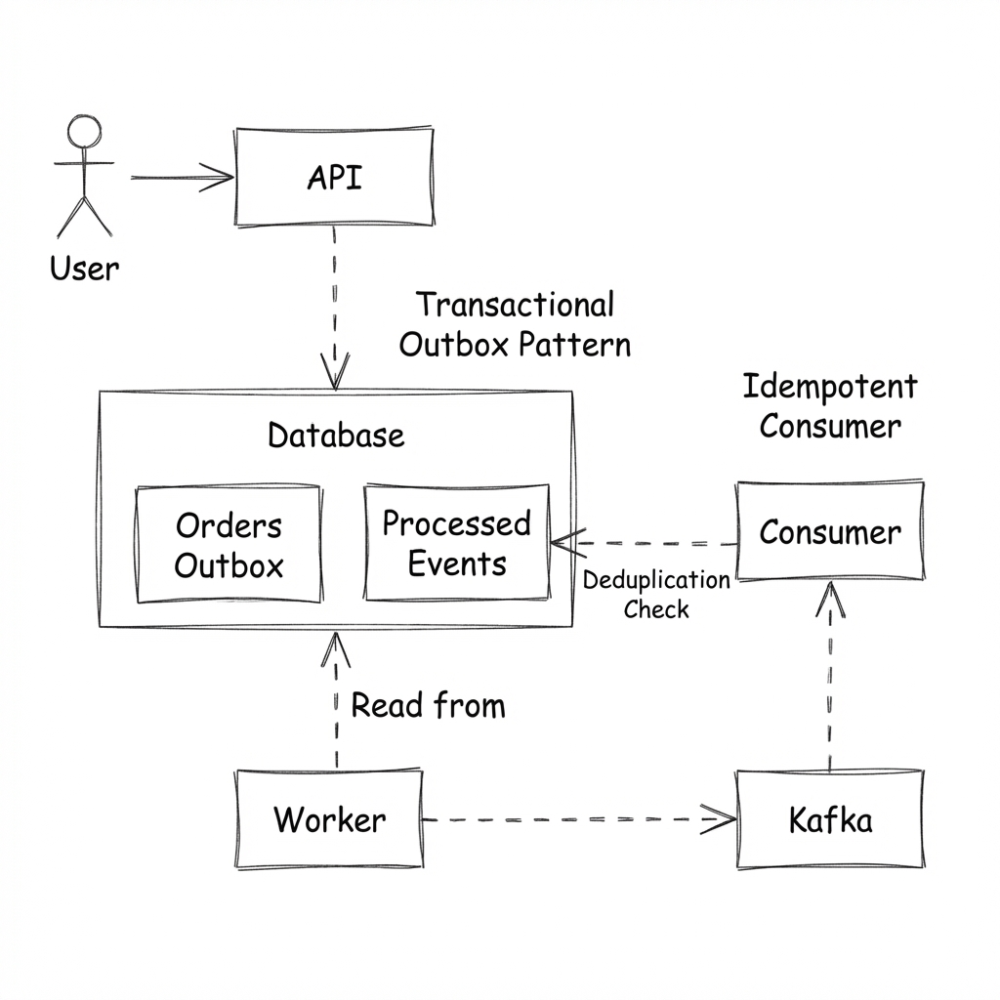

# Учебный проект

Этот проект является тренировочной реализацией. Он демонстрирует устойчивую, событийно-ориентированную архитектуру обработки заказов с симуляцией хаоса (сбоев).

## Особенности
- **Чистая архитектура (Clean Architecture)**: Domain, Usecase, Infrastructure (DI на фабриках).
- **Хранилище**: PostgreSQL (pgxpool) с поддержкой транзакций.
- **Очереди сообщений**: Kafka (Паттерн Transactional Outbox).
- **Транспорт**: REST API и gRPC (Скелет).
- **Инфраструктура**: Docker Compose, Kubernetes манифесты, HPA.
- **Управление секретами**: HashiCorp Vault + External Secrets Operator (ESO).
- **Надежность**: Идемпотентный Consumer (защита от дубликатов сообщений) и Transactional Outbox.
- **Производительность**: Оптимизированные SQL-запросы (индексы) и кэширование в Redis.
- **API**: Idempotency Key Middleware для защиты от повторных списаний.


## Схема работы (System Workflow)



## Как это работает?

Мы используем паттерн **Transactional Outbox**, чтобы ничего не потерять.

Представьте, что вы покупаете билет на самолет. Система должна сделать две вещи:
1.  Записать место за вами в Базе Данных (чтобы его не занял кто-то другой).
2.  Отправить вам билет на почту (сообщение в Kafka).

**Проблема**:
Если мы запишем место, но интернет моргнет, и билет не уйдет — вы расстроитесь. Если билет уйдет, но место не запишется — придут два человека на одно место.

**Решение**:
Мы делаем всё через "Исходящие" (как письма на почте).

1.  **Создание заказа (API)**:
    - Когда приходит заказ, API делает запись в БД: "Заказ создан".
    - В **той же самой** транзакции (одновременно) оно пишет запись в соседнюю таблицу `outbox` (Исходящие): "Нужно отправить событие".
    - *Почему это круто?* База данных гарантирует: либо запишутся **обе** записи, либо **ни одной**. Ситуация "заказ есть, а события нет" невозможна.

2.  **Отправка (Worker)**:
    - Есть специальный сервис-почтальон (**Worker**).
    - Он постоянно проверяет таблицу `outbox`: "Есть новые письма?".
    - Если есть, он берет их и отправляет в Kafka (наш почтовый ящик).
    - *Симуляция сбоев (Chaos)*: Наш почтальон иногда специально "роняет письма" (с вероятностью 20%), чтобы мы могли проверить, что система надежная и попытается отправить их снова.

3.  **Обработка (Consumer) — Умный получатель**:
    - Сервис-получатель (**Consumer**) следит за ящиком Kafka.
    - **Идемпотентность (Защита от дублей)**:
      - У него есть "Блокнот" (таблица `inbox_events` в БД).
      - Получив письмо, он сначала смотрит в блокнот: *"Я уже обрабатывал этот номер заказа?"*.
      - Если **ДА**: Он просто выкидывает письмо (игнорирует дубль).
      - Если **НЕТ**: Он выполняет работу, а потом записывает номер в блокнот.
    - **Настойчивость (Retry & DLQ)**:
      - Если при обработке произошла ошибка (например, БД "моргнула"), он не сдается.
      - Он попробует снова через 1 сек, потом через 2, 4, 8... (Exponential Backoff).
      - Если после 5 попыток всё равно не вышло, он отложит письмо в "Ящик проблемных писем" (**Dead Letter Queue**), чтобы не стопорить остальные, и пойдет дальше.
    - Это гарантирует, что даже если письмо придет дважды или что-то сломается, мы обработаем всё корректно и ничего не потеряем.

## Saga (Choreography) + Визуал на фронте

Проект расширен демонстрацией **Saga Choreography** (без оркестратора):

- Цепочка событий: `OrderCreated` -> `PaymentAuthorized` -> `TicketIssued`.
- Участники саги (отдельные consumer-group):
  - `payment-service`: обрабатывает `OrderCreated`, пишет `payments`, публикует `PaymentAuthorized` через `outbox`.
  - `ticket-service`: обрабатывает `PaymentAuthorized`, пишет `tickets`, публикует `TicketIssued` через `outbox`.
  - `order-service` (consumer): обрабатывает `TicketIssued` и переводит заказ в финальный статус.
- Для учебного визуала добавлен endpoint: `GET /orders/{id}/workflow` (на фронте: `/api/orders/{id}/workflow`), который возвращает состояние заказа + события `outbox`/`inbox`.


## Наблюдаемость (Observability) и Grafana

Проект включает предварительно настроенный стек мониторинга с Prometheus и Grafana.

**Дашборд: E2E Order Flow**
Дашборд Grafana (доступен по адресу `http://localhost:3000`) предоставляет информацию о здоровье и производительности системы в реальном времени:

1.  **Flow: Published vs Processed** (Левая панель):
    - **Зеленая линия (Events Published)**: Показывает скорость успешно опубликованных Воркером событий в Kafka.
    - **Желтая линия (Orders Processed)**: Показывает скорость заказов, потребленных и обработанных Консьюмером.
    - **Инсайт**: В идеале эти линии должны идти близко друг к другу. Увеличивающийся разрыв указывает на отставание Консьюмера или задержки в Kafka.

2.  **Chaos: Simulated Failures** (Правая панель):
    - **Столбцы**: Представляют количество симулированных ошибок, сгенерированных Воркером.
    - **Инсайт**: В Воркере жестко запрограммирована 20% вероятность сбоя для симуляции нестабильности распределенной системы (например, недоступность брокера). Эта панель отслеживает, как часто происходят эти "события хаоса".

## Технический стек (Tech Stack)
- Go 1.21+
- PostgreSQL
- Redis
- Kafka
- Prometheus / Grafana
- HashiCorp Vault / External Secrets Operator
- Docker / Kubernetes

## Ключевые достижения (Achievements)

Проект демонстрирует реализацию решений из опыта разработки высоконагруженных систем (>500 тыс. транзакций/день):

1.  **Оптимизация БД**:
    - Индексы и анализ планов запросов (Explain Analyze).
    - *Результат*: Снижение времени отклика API с 380 мс до 95 мс в пиковые периоды.

2.  **Кэширование (Redis)**:
    - Кэширование корзины и данных о доступности товаров с TTL.
    - Реализована защита от **Cache Stampede** и событийная инвалидация.
    - *Результат*: Снижение нагрузки на PostgreSQL на 60%.

3.  **Надежность и Отказоустойчивость**:
    - **API Idempotency**: Обработка `Idempotency-Key` для защиты от дублирующих запросов на создание заказа.
    - **Transactional Outbox**: Гарантия доставки событий (Kafka) без потерь.
    - **Smart Consumer**: Дедупликация на стороне воркера (inbox_events table), Retry с Exponential Backoff и Dead Letter Queue (DLQ).
    - **Worker Scaling**: Реализован паттерн **Claim Check** (`FOR UPDATE SKIP LOCKED`), позволяющий запускать любое количество реплик воркера без гонок данных.
    - *Результат*: Снижение ручных корректировок данных на 85%.

4.  **Архитектура**:
    - Динамическое ценообразование (имитация через конфигурацию правил).
    - Выгрузка отчетов (скелет ETL процесса).
    - **Логирование**: Внедрен **ELK Stack** (Elasticsearch, Logstash/Filebeat, Kibana) для централизованного сбора структурных логов (JSON).


## Начало работы (Getting Started)

1.  **Запуск всего проекта (Backend + Frontend + Infra)**:
    ```bash
    make up
    ```
    Скрипт `scripts/start.sh`:
    - поднимает инфраструктуру через Docker Compose (Postgres/Redis/Kafka + observability)
    - собирает Go-бинарники в `bin/`
    - применяет миграции (в т.ч. saga-таблицы/колонки)
    - запускает локально сервисы: `api`, `worker`, `consumer` (order-service), `payment-service`, `ticket-service`
    - запускает фронт (Vite)

    Полезные адреса:
    - Frontend: `http://localhost:5173`
    - API: `http://localhost:8080`
    - Grafana: `http://localhost:3000` (пароль по умолчанию: `admin`)

    Опционально (файловая конфигурация):
    ```bash
    cp config.example.yaml config.yaml
    ```

2.  **Остановка**:
    ```bash
    make down
    ```

3.  **Ручной запуск сервисов (если нужно)**:
    ```bash
    go run cmd/api/main.go
    go run cmd/worker/main.go
    KAFKA_GROUP_ID=order-service go run cmd/consumer/main.go
    KAFKA_GROUP_ID=payment-service go run cmd/payment/main.go
    KAFKA_GROUP_ID=ticket-service go run cmd/ticket/main.go
    ```

4.  **Управление секретами (Kubernetes)**:
    Проект поддерживает интеграцию с Vault для безопасного хранения секретов.
    
    *Установка платформы (Vault + ESO):*
    ```bash
    make k8s-platform
    ```
    
    *Настройка секретов (Синхронизация):*
    ```bash
    make k8s-secrets
    ```

    Перед запуском k8s-части замените `REPLACE_ME` в `k8s/platform/vault.yaml` и `k8s/secrets/secret-store.yaml`.
