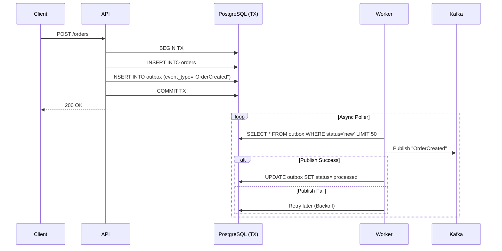
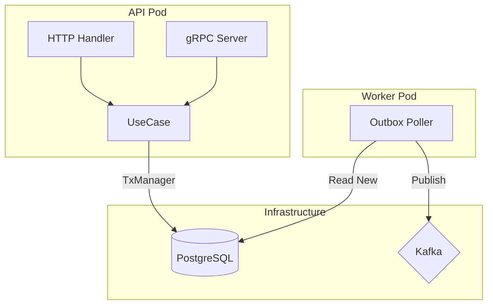

# Architecture V2: gRPC & Outbox

## 1. Project Overview (Current State)
The current project is a **Modular Monolith** in Go, designed for high load (WB/PVZ context).
- **Core**: Go 1.21, Clean Architecture (simplified).
- **Storage**: PostgreSQL (pgxpool).
- **Messaging**: Kafka (producer/consumer).
- **Cache**: Redis.
- **Infrastructure**: Docker Compose, Kubernetes manifests (Deployment, HPA).
- **Observability**: Prometheus metrics.

### Key Decisions
- **Factory Pattern**: strict dependency injection via `internal/application/factories`.
- **Infrastructure Layer**: Isolated in `internal/infrastructure`. Domains do not import infrastructure directly.

## 2. New Requirements via V2

### A. gRPC Service
We will add a gRPC interface to the API service.
- **Protocol**: Protocol Buffers v3.
- **Role**: High-performance inter-service communication (e.g., typically used for internal traffic vs REST for external).

### B. Transactional Outbox Pattern
To guarantee **simultaneous** database update and event publishing.

#### The Workflow
1. **API Request**: User creates an order (`POST /orders`).
2. **Transaction Start**: Start Postgres transaction.
3. **Data Write**: Insert into `orders` table.
4. **Outbox Write**: Insert event into `outbox` table (payload: JSON).
5. **Commit**: Commit transaction. (If fails, neither happens).
6. **Async Worker**:
   - Loop pulls unprocessed events from `outbox`.
   - Publishes to Kafka `orders-events` topic.
   - Marks entry as `processed` (or deletes it).

## 3. Diagrams

### Outbox Flow

### Component View

